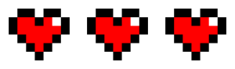
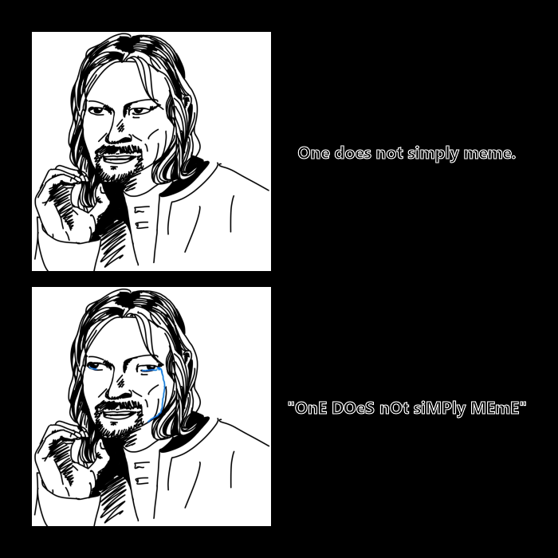

# My First Meme
### *A Practical Tutorial*
***

The meme I decided to create does not necessarilly follow a specific "meme format". I wanted to develop the kind of gif that is used as a **response** to something (*eg. what would typically be found in the comment section of a post on social media*). <br>
Memes are a form of comunication; they say a lot about a person's interests, their socio-economic standing, or even mental well-being. They express something that is relatable or understood beyond what is literally depicted. My meme is inspired by **vintage arcade games** and the trending **indie game scene** that often uses pixel art. It is a style that feels familiar and gives the perceiver a sense of nostalgia or childishness. <br>

 <br>
[Zelda Fandom Webpage](https://zelda.fandom.com/wiki/The_Legend_of_Zelda) <br>
<br>

[Official INMOST Webpage](https://inmostgame.com/)
<br>
<br>
>## DED 💔 💀 💀
> <br>
> ~ Random Comment

A common reaction to posts on social media nowadays are to be shocked or embarassed. I came up with the idea of showing a health bar declining, followed by a *"game over"* in a typical 80s style, in hopes that it would make for a good reaction meme that is ironic, easily interpreted and feels familiar.


> ### Skills we will use to build our GIF:
> - Defining coloured blocks to use as pixels
> - Appending these blocks of coloured pixels to a vector of 'pixel rows'
> - Stacking the rows to create a vector of 'pixel rows' that completes the image
> - Appending full images in a row to mimic a health bar
> - Creating the right combinations of images to animate later
> - Croping and color-editing a background image from the internet
> - Annotating text over a stylised background
> - Animating the final combination of images

It seems harder than it is, so below is a simple example of formatting images and appending them together. We will be using this technique later in order to build our pixel art later on.
***
# *Let's start coding!*
<br>

> ### Steps for building a simple meme:
> 1. Upload images
> 2. Crop or scale them to size
> 3. Add frames (optional)
> 4. Render two black blocks of the same size as the meme images
> 5. Annotate over the blocks
> 6. Edit variables such as font, gravity, size, weight and strokecolor (optional)
> 7. Append the images together and the text blocks together to form columns
> 8. Bring the columns together
> 9. After a final check, save the image
>
> ### Here is a code sample that uses the [{magick}](https://cran.r-project.org/web/packages/magick/vignettes/intro.html) package to create our simple meme:
>
> - **Loading the [{magick}](https://cran.r-project.org/web/packages/magick/vignettes/intro.html) package.**
> ```
> library(magick)
> ```
> - **Uploading images from folder**
>     - Scaling and cropping them to size 300x300px with *'image_scale()'* and *'image_crop()'*
>     - Adding a frame with *'image_border'*
> ```
> #Meme images
> meme_face_1 = image_read(path = "Images/Meme_Face_1.jpg") %>%
>   image_trim() %>%
>   image_scale(300) %>%
>   image_crop(geometry = "300x300", gravity = 'north') %>%
>   image_border(color = "#000000", geometry = "10x10")
>
> meme_face_2 = image_read(path = "Images/Meme_Face_2.jpg") %>%
>   image_trim() %>%
>   image_scale(300) %>%
>   image_crop(geometry = "300x300", gravity = 'north') %>%
>   image_border(color = "#000000", geometry = "10x10")
> ```
> - **Creating a blank image and annotating over it**
>     - Centering the text with *'gravity'*
>     - Making the text **bold** with *'weight'* 
>     - Adding a colour around the letters with *'strokecolor'*
>     
> ``` 
> #Text
> annotate_1 = image_blank(300, 300, color = "black") %>%
>   image_annotate(text = "One does not simply meme.",
>                  gravity = "center", size = 21.5, 
>                  weight = 700, font = "Helvetica",
>                  strokecolor = "white") %>%
>   image_scale(300) %>%
>   image_border(color = "#000000", geometry = "10x10")
>
> annotate_2 = image_blank(300, 300, color = "black") %>%
>   image_annotate(text = '"OnE DOeS nOt siMPly MEmE"',
>                  gravity = "center", size = 21.5, 
>                  weight = 700, font = "Helvetica",
>                  strokecolor = "white") %>%
>   image_scale(300) %>%
>   image_border(color = "#000000", geometry = "10x10")
> ```
> - **Stacking the images and the text blocks to create two columns**
> ```
> #Meme Columns
> picture = image_append(c(meme_face_1, meme_face_2), stack = T)
> words = image_append(c(annotate_1, annotate_2), stack = T)
> ```
> - **Appending the two columns together to complete the meme**
> ```
> #Full meme
> full_meme = image_append(c(picture, words))  %>%
>   image_border(color = "#000000", geometry = "30x30")
> full_meme
> ```
> - **A final check on the individual consituent's details**
> ```
> #final check
> image_info(c(meme_face_1, meme_face_2, annotate_1, annotate_2))
> ```
> - **Saving the image in a subfolder named *'Images'***
> ```
> #storing image
> image_write(full_meme, path = "Images/One Does Not Simply Meme.png", format = "png")
> ```
> ### Our final result!
>  


# *Now to building a GIF!*

### Here is a program that uses the [{magick}](https://cran.r-project.org/web/packages/magick/vignettes/intro.html) package to build our GIF:
```
library(magick)

#'pixel' dimensions
s_height = 30` <br>
s_width = 30` <br>
```

**1. Setting colors:**
```
red_square = image_blank(s_width, s_height, color = "#ff0000")
dark_square = image_blank(s_width, s_height, color = "#870000")
bl_square = image_blank(s_width, s_height, color = "#000000")
w_square = image_blank(s_width, s_height, color = "#ffffff")
```

**2. Creating rows of "pixels" for first heart:**
```
w_row = c(w_square, w_square, w_square, w_square, w_square,
          w_square, w_square, w_square, w_square) %>%
  image_append()

row_1 = c(w_square, w_square, bl_square, bl_square, w_square,
          bl_square, bl_square, w_square, w_square) %>%
  image_append()

row_2 = c(w_square, bl_square, red_square, red_square, bl_square,
          red_square, w_square, bl_square, w_square) %>%
  image_append()

row_3 = c(w_square, bl_square, red_square, red_square, red_square,
          red_square, red_square, bl_square, w_square) %>%
  image_append()

row_4 = c(w_square, w_square, bl_square, red_square, red_square,
          red_square, bl_square, w_square, w_square) %>%
  image_append()

row_5 = c(w_square, w_square, w_square, bl_square, red_square,
          bl_square, w_square, w_square, w_square) %>%
  image_append()

row_6 = c(w_square, w_square, w_square, w_square, bl_square,
          w_square, w_square, w_square, w_square) %>%
  image_append()
```


**3. First completed heart:**
```
heart_1 = c(w_row, row_1, row_2, row_3, row_4, row_5, row_6, w_row) %>%
  image_append(stack = TRUE) %>%
  image_scale(100)
```


**4. A darker heart to make it seem like it's beating:**
```
#Rows for dark heart
w_row = c(w_square, w_square, w_square, w_square, w_square,
          w_square, w_square, w_square, w_square) %>%
  image_append()

row_1a = row_1

row_2a = c(w_square, bl_square, dark_square, dark_square, bl_square,
           dark_square, w_square, bl_square, w_square) %>%
  image_append()

row_3a = c(w_square, bl_square, dark_square, dark_square, dark_square,
           dark_square, dark_square, bl_square, w_square) %>%
  image_append()

row_4a = c(w_square, w_square, bl_square, dark_square, dark_square,
           dark_square, bl_square, w_square, w_square) %>%
  image_append()

row_5a = c(w_square, w_square, w_square, bl_square, dark_square,
           bl_square, w_square, w_square, w_square) %>%
  image_append()

row_6a = c(w_square, w_square, w_square, w_square, bl_square,
           w_square, w_square, w_square, w_square) %>%
  image_append()
```


**5. Completed dark heart:**
```
dark_heart = c(w_row, row_1a, row_2a, row_3a, row_4a, row_5a, row_6a, w_row) %>%
  image_append(stack = TRUE) %>%
  image_scale(100)
```


**6. To do the heart-popping effect, I will need to create three extra images to replace the heart with when it disappears:**
```
#Rows for heart 2
row_2b = c(w_square, w_square, bl_square, bl_square, w_square,
           bl_square, bl_square, w_square, w_square) %>%
  image_append()

row_3b = c(w_square, w_square, bl_square, red_square, red_square,
           red_square, bl_square, w_square, w_square) %>%
  image_append()

row_4b = c(w_square, w_square, w_square, bl_square,
           red_square, bl_square, w_square, w_square, w_square) %>%
  image_append()

row_5b = row_6a
```

```
#Smaller heart #1
heart_2 = c(w_row, w_row, row_2b, row_3b, row_4b, row_5b, w_row, w_row) %>%
  image_append(stack = TRUE) %>%
  image_scale(100)
```


**7. Here are the rows for heart 3 (aka. smaller heart #2):**
```
row_2c = row_2b

row_3c = c(w_square, w_square, bl_square, bl_square, bl_square,
           bl_square, bl_square, w_square, w_square) %>%
  image_append()

row_4c = c(w_square, w_square, w_square, bl_square, bl_square,
           bl_square, w_square, w_square, w_square) %>%
  image_append()

row_5c = row_6a
```


**8. Smaller heart #2:**
```
heart_3 = c(w_row, w_row, row_2c, row_3c, row_4c, row_5c, w_row, w_row) %>%
  image_append(stack = TRUE) %>%
  image_scale(100)
```


**9. Here are the rows for heart 4 (black heart):**
```
row_1d = c(w_square, w_square, bl_square, w_square, w_square,
           w_square, bl_square, w_square, w_square) %>%
  image_append()

row_2d = c(w_square, w_square, w_square, bl_square,
           w_square, bl_square, w_square, w_square, w_square) %>%
  image_append()

row_3d = c(w_square, w_square, w_square, w_square, bl_square,
           w_square, w_square, w_square, w_square) %>%
  image_append()

row_4d = row_2d

row_5d = row_1d
```


**10. Black heart and empty heart:**
```
heart_4 = c(w_row, row_1d, row_2d, row_3d, row_4d, row_5d, w_row, w_row) %>%
  image_append(stack = TRUE) %>%
  image_scale(100)

#Empty heart
heart_5 = c(w_row, w_row, w_row, w_row, w_row, w_row, w_row, w_row) %>%
  image_append(stack = TRUE) %>%
  image_scale(100)
```


**11. Generating 13 health-bars to animate later:**
``` 
health_bar_1 = image_append(c(heart_1, heart_1, heart_1))

health_bar_2 = image_append(c(dark_heart, dark_heart, heart_2))
health_bar_3 = image_append(c(heart_1, heart_1, heart_3))

health_bar_4 = image_append(c(dark_heart, dark_heart, heart_4))
health_bar_5 = image_append(c(heart_1, heart_1, heart_5))

health_bar_6 = image_append(c(dark_heart, heart_2, heart_5))
health_bar_7 = image_append(c(heart_1, heart_3, heart_5))

health_bar_8 = image_append(c(dark_heart, heart_4, heart_5))
health_bar_9 = image_append(c(heart_1, heart_5, heart_5))

health_bar_10 = image_append(c(heart_2, heart_5, heart_5))
health_bar_11 = image_append(c(heart_3, heart_5, heart_5))
health_bar_12 = image_append(c(heart_4, heart_5, heart_5))
health_bar_13 = image_append(c(heart_5, heart_5, heart_5))
```


**12. GAME OVER annotation and empty image for lightning effect:**
```
message = "GAME OVER"

lightning = image_read(path = "Images/Lightning_Bolt.png")  %>%
  image_scale(300) %>%
  image_crop("300x100") %>%
  image_negate() %>%
  image_annotate(message, gravity = "center", size = "40", weight = 700,
                 font = "Georgia", color = "#ffee00") 


empty_1 = image_blank(color = "#1900ff", width = 300, height = 100)
```

**13. Compiling everything to finally animate and save .gif:**
```
#Final Animation:
frames <- c(health_bar_1, health_bar_2, health_bar_3, health_bar_4, health_bar_5,
            health_bar_6, health_bar_7, health_bar_8, health_bar_9, health_bar_10,
            health_bar_11, health_bar_12, health_bar_13,
            lightning, empty_1, lightning, empty_1, lightning, lightning, lightning)

game_over = image_animate(frames, fps = 5)
game_over
image_write(game_over, path = "Images/Game_Over.gif", format = "gif")``
```

### Our final result


### Hopefully by the end of this tutorial, you should be able to understand the following tasks:
- [x] Defining coloured blocks to use as pixels
- [x] Appending these blocks of coloured pixels to a vector of 'pixel rows'
- [x] Stacking the rows to create a vector of 'pixel rows' that completes the image
- [x] Appending full images in a row to mimic a health bar
- [x] Creating the right combinations of images to animate later
- [x] Croping and color-editing a background image from the internet
- [x] Annotating text over a stylised background
- [x] Animating the final combination of images


